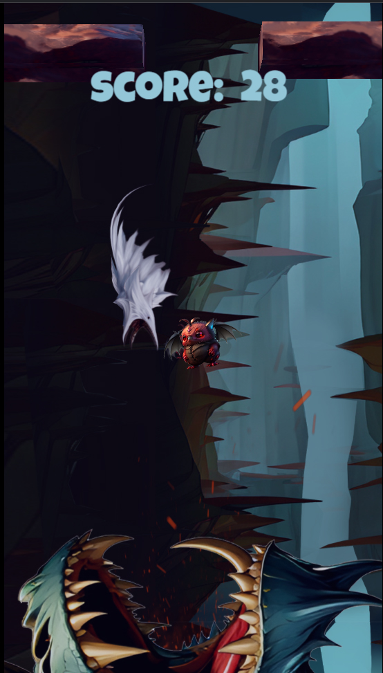


### BAT BAT

En un mundo lleno de magia y misterios, un valiente murciélago llamado Noctis se ve atrapado en una cueva oscura y peligrosa habitada por un antiguo y poderoso dragón llamado Drakkar. Durante siglos, el dragón ha gobernado sobre la cueva, acumulando tesoros y devorando a cualquier intruso que se atreva a adentrarse en su dominio.



 Bat Bat es un juego donde todos sus elementos graficos fueron realizados con inteligencias artificiales.


INCOMPLETO

